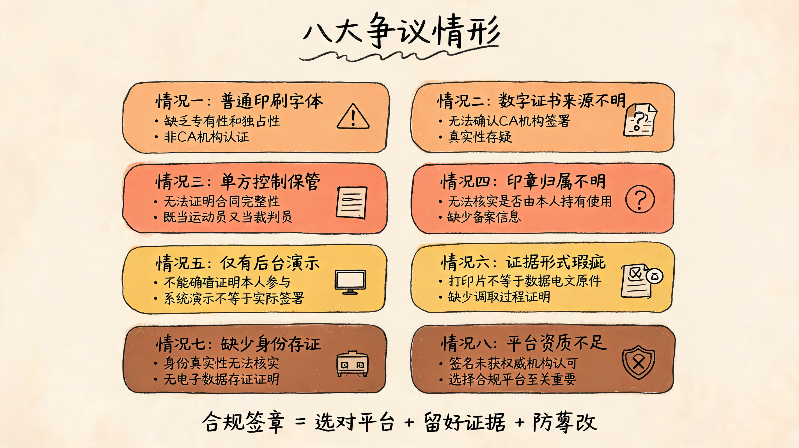
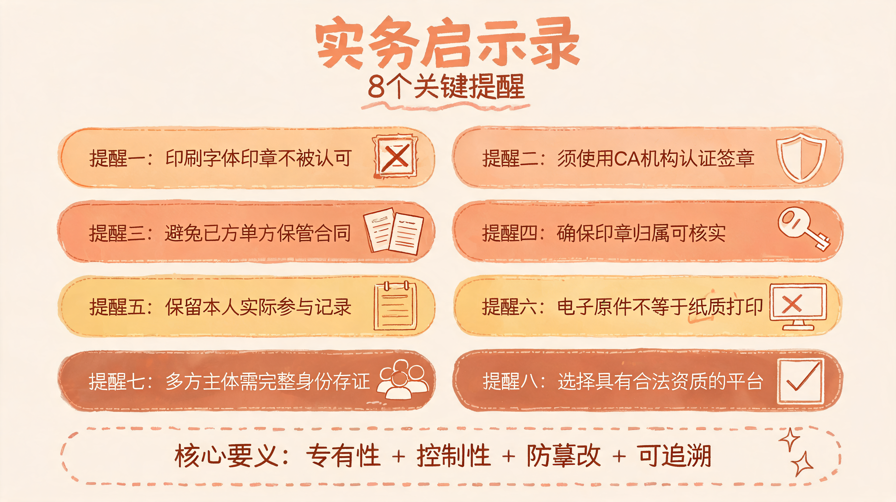
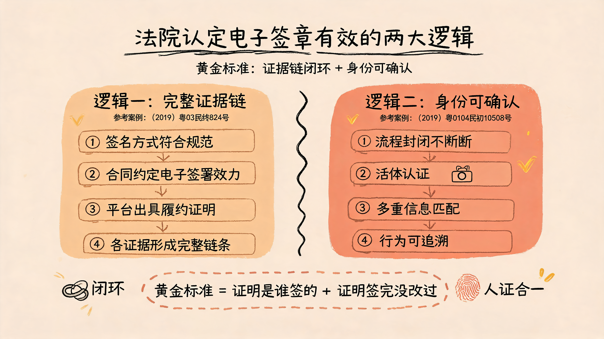

# 数字指纹，契约新章：电子签章效力实务解析

导语：电子签章≠当然有效

在数字经济高速发展的今天，电子合同、电子签名、电子签章已经成为企业降本增效的标配。但许多企业和个人存在一个误区：认为只要用了电子签章，合同就“板上钉钉”。

事实并非如此。

我们通过梳理近年司法判例发现：法院对电子签章效力的审查日趋严格，大量案件因电子签章不符合法定要件而被认定无效。本文结合10个司法实务案例，拆解法院认定电子签章效力的核心逻辑，帮助企业和个人在实务中规避风险。

## 一、法律依据：电子签章有效的“底层规则”

### 1.1 电子签章的法律地位

《中华人民共和国电子签名法》第三条、第十三条、第十四条为电子签章的合法性奠定了基础：

• 第三条：民事活动中，当事人可以约定使用电子签名、数据电文，不得仅因其采用电子形式而否定法律效力。

• 第十三条：电子签名制作数据用于电子签名时，属于电子签名人专有；签署时电子签名制作数据仅由电子签名人控制；签署后对电子签名的任何改动能够被发现；签署后对数据电文内容和形式的任何改动能够被发现。

• 第十四条：可靠的电子签名与手写签名或者盖章具有同等法律效力。

### 1.2 什么是“可靠的电子签名”？

《电子签名法》第十三条明确了“可靠电子签名”的四大要件：

1. 专有性：电子签名制作数据属于签名人专有；

2. 控制性：签署时电子签名制作数据仅由电子签名人控制；

3. 防篡改（签名）：签署后对电子签名的任何改动能够被发现；

4. 防篡改（内容）：签署后对数据电文内容和形式的任何改动能够被发现。

简言之：不是随便盖个“电子章”就算数，必须能证明“是你签的”且“签后没改过”。

### 1.3 《民法典》的兜底保障

《民法典》将数据电文形式的合同纳入书面合同范畴，从民事基本法层面进一步确认了电子合同的合法性。但需注意：法律承认电子合同的形式，不等于每一份电子合同都必然有效。规范层面的承认与司法实践中的采信标准之间，却存在一定张力。近年裁判文书显示，相当比例的电子签章因不符合法定要件或举证不足而未被法院采信。

- “实战结果”法院认定电子签章“无效”的案例分析

- 图片1

- 图片2（图片插入成功后就可以删除以下表格）

| 案号 | 裁判摘要 |

| --- | --- |

| (2020)湘11执207号 | 本案中，申请执行人提交的《补充协议》不仅确认了债权的数额，还将发生争议时向人民法院提起诉讼的约定改为由南平仲裁委员会进行裁决，属于实体权利的重大变更，但该协议的落款处仅有一枚字样“毛嶷敏印”的电子印章，其上的字体为普通印刷字体，无法认定其具有专有性和独占性，不应认为是可靠的电子签名，无法确认为毛嶷敏本人签署。 |

| (2020)辽04执458号 | 本院无法确定《补充协议》中“张元峰印”字样系被申请执行人使用CA机构颁发的有效数字+证书签署的签章，无法确认电子签章的真实性以及是否系其真实意思表示。 |

| (2019)京0105民初8152号 | 被告在原告的电子合同上签字，双方未形成纸质版合同，而该电子合同的数据电文由原告控制保管，而从审批结果通知书可以看出，被告向银行提供的抵押物为两套房屋，与委托合同中所载抵押物不符，原告应举证证明该合同的完整性、未被更改，但其现表示已无法从数据库后台复现上述合同，应自行承担相应责任，故其提交的《房屋抵押贷款委托合同》，法院不予采信。 |

| (2020)渝0112民初11149号 | 本案中原告诉称与被告之间存在借贷法律关系，应当对双方存在借款合意进行证明，原告提供的借款协议打印件中电子合同专用章，无法核实其是否属于被告公司持有、使用，原告也未能提供其他证据对双方存在借款合意予以证明。 |

| (2020)湘01民终2973号 | 上诉人提供的证据仅能体现其后台系统的演示过程，不能确凿证实王国栋或其代理人参与了电子签章或领取了涉案租赁车辆，不能达到其证明目的。其未提供充分证据证明涉案电子签名为可靠的电子签名，无法确认数据电文是否保持完整，未被更改，不能确认承租方签字处“王国栋”的名字为其本人所签。 |

| (2020)川01民终2834号 | 法院二审认定曹某提交的两份线上《借款合同》均系复印件，其未在证据交换的程序中对合同的调取过程进行证明，故上述证据不符合《中华人民共和国电子签名法》中对于数据电文证据原件形式的要求。 |

| (2019)桂执复72号 | 本案无出借人身份证明，出借人的真实性无法核实。《借款协议（A版本）》文末签署信息仅有“耿某、邓某、张某、陆某”、“余某”打印字样，没有相应的能证明出借人及借款人身份的《电子数据存证证明》，无法确认《借款协议（A版本）》中签名字样系本人使用CA机构颁发的有效数字证书签署的签章，无法确认电子签章的真实性以及是否系其真实意思表示。 |

| (2020)渝民辖70号 | 经审查，该案原被告之间签订的电子合同没有经过国家机关的认证，被告的电子签名也没有得到国家权威部门的认可，因此导致电子合同无效，被告占有原告发放的借款没有合法的依据和约定，应当向原告返还该笔款项。 |

通过对近年裁判文书的梳理，我们归纳出法院否定电子签章效力的高频理由：

#### 情形一：电子印章为普通印刷字体，缺乏专有性和独占性

相关案例：(2020)湘11执207号

涉案《补充协议》落款处仅有一枚字样“毛嶷敏印”的电子印章，字体为普通印刷字体，法院认定其“无法认定具有专有性和独占性”，不应认为是可靠的电子签名。

实务启示：

简单的图片印章、文字印章不具备法律效力。必须使用经CA机构认证的、具有唯一性的数字证书签章。

#### 情形二：无法确认电子签章由CA机构颁发的有效数字证书签署

相关案例：(2020)辽04执458号、(2019)桂执复72号

法院无法确定签章系被申请执行人使用CA机构颁发的有效数字证书签署，无法确认电子签章的真实性及是否系真实意思表示。

实务启示：

使用未经合法CA机构认证的电子签章平台，一旦发生纠纷，签章真实性极易被质疑。

#### 情形三：电子合同由一方控制保管，无法证明完整性和未被更改

相关案例：(2019)京0105民初8152号

电子合同的数据电文由原告控制保管，原告无法从数据库后台复现合同，亦无法举证证明合同完整性、未被更改，法院对该电子合同不予采信。

实务启示：

合同由己方平台保管存在“既当运动员又当裁判员”的风险。建议引入第三方存证机构（如区块链存证）固化合同签署过程和内容。

#### 情形四：无法核实电子印章是否属于被告公司持有、使用

相关案例：(2020)渝0112民初11149号

原告提供的借款协议打印件中的电子合同专用章，无法核实是否属于被告公司持有、使用，原告也未能提供其他证据证明借款合意。

实务启示：

仅有合同上的电子印章不足以证明合同成立。需补充提供印章备案信息、使用授权记录、签署过程证据等。

#### 情形五：仅有后台系统演示，不能证明签名人实际参与

相关案例：(2020)湘01民终2973号

上诉人提供的证据仅能体现其后台系统的演示过程，不能确凿证实王国栋或其代理人参与了电子签章或领取了涉案租赁车辆，不能达到其证明目的。

实务启示：

“我们的系统可以这么签”不等于“对方确实这么签了”。必须保留针对具体合同、具体签名人的签署记录。

#### 情形六：证据形式不符合“原件”要求

相关案例：(2020)川01民终2834号

上诉人提交的两份线上《借款合同》均系复印件，其未在证据交换程序中对合同的调取过程进行证明，法院认定上述证据不符合《电子签名法》对数据电文证据原件形式的要求。

实务启示：

电子合同的“原件”不等于纸质打印件。根据《电子签名法》第五条，能够有效地表现所载内容并可供随时调取查用的数据电文，视为满足法律、法规规定的原件形式要求。提交证据时应说明数据来源、调取过程，必要时申请电子数据鉴定。

#### 情形七：缺乏出借人身份证明及电子数据存证证明

相关案例：(2019)桂执复72号

本案无出借人身份证明，出借人真实性无法核实。《借款协议》文末签署信息仅有打印字样，没有相应的《电子数据存证证明》，无法确认签名字样系本人使用CA机构颁发的有效数字证书签署的签章。

实务启示：

在涉及多方主体的合同中，每一方的身份认证和签章记录都应完整留存，不能遗漏。

#### 情形八：电子合同未经国家机关认证，电子签名未获国家权威部门认可

相关案例：(2020)渝民辖70号

该案原被告之间签订的电子合同没有经过国家机关的认证，被告的电子签名也没有得到国家权威部门的认可，因此导致电子合同无效。

实务启示：

虽然“必须经过国家机关认证”这一表述在实务中存在争议（并非所有电子签章都必须经行政机关事前审批），但该案警示我们：选择具有合法资质、获得行业认可的电子签章平台至关重要。

## 三、法院认定电子签章“有效”的实务案例及其两大支撑逻辑

并非所有电子签章都会被否定。在有效案例中，法院支持电子签章效力的核心逻辑是什么？

图片3（图片插入成功后就可以删除以下表格）

| 案号 | 裁判结果 |

| --- | --- |

| (2019)粤03民终824号 | 一方面，上诉人徐爱菊的担保保证书用的是电子签名的方式，合乎规范的电子签名为合法的签名方式。另一方面，本案合同均通过合拍在线网络平台签订，涉案合同均载明通过在线点击生成合同具有法律效力，且合拍公司也出具了证明，证明被上诉人山东信茂公司已依照约定履行了担保责任，上述证据能构成完整的证据链。据此可以认定涉案合同合法有效，各方应依约履行。 |

| (2019)粤0104民初10508号 | 本案中，被告向原告申请贷款的整个流程与操作，是连贯且不间断的完整、封闭的操作过程，在此过程中，被告需要依次向原告提交本人的身份证原件扫描件、个人银行卡、手机号码、并在摄像头前按要求作出两个动作证明其是活体真人。完成上述操作后，原告的后台管理系统会对银行、公安、客户提交的信息进行匹配以确定是被告本人进行的真实有效操作。这一操作流程，事实上满足了识别签名人身份与表明签名人认可其所有操作的要求，因此在该封闭操作中，被告所有的勾选行为，均符合法律对电子签名的认定，因此被告以该合同未经其本人手写签名而否认合同效力的抗辩理由不成立，该合同自被告提交给原告进行审核通过时成立。 |

逻辑一：符合规范 + 平台证明 = 完整证据链

相关案例：(2019)粤03民终824号

上诉人的担保保证书使用电子签名方式，属于合法的签名方式。涉案合同均通过合拍在线网络平台签订，合同均载明在线点击生成合同具有法律效力，且平台出具了证明，证明被上诉人已依照约定履行了担保责任。上述证据能构成完整的证据链，据此认定涉案合同合法有效。

关键要素拆解：

1. 电子签名方式本身符合规范；

2. 合同文本明确约定了电子签署的法律效力；

3. 有平台出具的履约证明，补强了合同履行的真实性；

4. 各证据之间形成完整证据链。

逻辑二：封闭操作 + 活体认证 + 多重信息匹配 = 身份可确认

相关案例：(2019)粤0104民初10508号

被告向原告申请贷款的整个流程是连贯且不间断的完整、封闭的操作过程。在此过程中，被告需要依次提交身份证原件扫描件、个人银行卡、手机号码，并在摄像头前按要求作出两个动作证明其为活体真人。完成上述操作后，后台管理系统会对银行、公安、客户提交的信息进行匹配，以确定是被告本人进行的真实有效操作。这一操作流程，事实上满足了“识别签名人身份”与“表明签名人认可其所有操作”的要求，因此被告所有的勾选行为，均符合法律对电子签名的认定。

关键要素拆解：

1. 流程封闭：整个签约过程连贯不间断，排除了他人冒签的可能性；

2. 活体认证：通过摄像头进行人脸识别+动作验证，确保“人证合一”；

3. 信息匹配：系统对接银行、公安数据库进行身份核验；

4. 行为可追溯：每一个操作步骤均有记录，能够证明签名人“知情且同意”。

这是目前司法实践中对电子签章效力认定的“黄金标准”。

## 四、实务指引：如何让电子签章“经得起诉”？

基于上述案例分析，我们为企业使用电子签章提出以下实务建议：

建议一：选择合规的电子签章平台

• 优先选择具有《电子认证服务许可证》的CA机构或与其合作的电子签章平台；

• 确认平台能够提供完整的签署日志、时间戳、数字证书、哈希值校验等技术支撑；

• 避免使用简单的“图片盖章”工具或未经认证的免费签章软件。

建议二：确保签约流程满足“可靠电子签名”四要件

在设计和使用电子签约流程时，应当能够回答以下四个问题：

1. 专有性：该签章数据是否仅为签名人所独有？

2. 控制性：签署时是否只有签名人能够控制该签章数据？

3. 签名防篡改：签章生成后，任何改动是否都能被发现？

4. 内容防篡改：合同内容签章后，任何改动是否都能被发现？

如果上述任一问题的答案为“否”，则该电子签章存在被法院否定的风险。

建议三：保留完整的签约过程证据

不要只保存一份“带章的合同PDF”，还应当保留：

• 签署人的身份认证记录（身份证核验、人脸识别、银行卡验证、手机号验证等）；

• 签署时间戳和IP地址记录；

• 短信通知/邮件通知记录；

• 签署操作日志（每一步点击、勾选、确认的时间节点）；

• 第三方存证机构出具的电子数据存证证明。

建议四：在合同中明确约定电子签章的法律效力

在电子合同的首部或签署条款中，明确载明：

“本合同以电子签名方式签署，各方确认该电子签名与手写签名或盖章具有同等法律效力。各方同意，通过本系统在线点击确认、勾选同意的行为视为有效的签署行为。”

这虽然不是电子签章有效的决定性因素，但可以在纠纷发生时减少争议空间。

建议五：发生纠纷时，主动完成举证闭环

根据《最高人民法院关于民事诉讼证据的若干规定》，电子数据作为证据的，应当提供原件或能够证明真实性的副本。在诉讼中，原告方应当：

1. 说明电子合同的生成、传输、存储、调取过程；

2. 申请第三方存证平台出具证明；

3. 必要时申请电子数据司法鉴定；

4. 补充提供履约过程证据（如付款记录、履约通知等），形成完整证据链。

## 五、结语：电子签章的“便利”与“风险”并存

电子签章确实大大提高了交易效率，但便利不等于安全，使用不等于有效。

从司法实践来看，法院对电子签章效力的审查核心始终围绕两个问题：

1. 是不是他本人签的？

2. 签完之后有没有被改过？

如果企业和个人在使用电子签章时，能够从这两个问题出发，完善签约流程、保留过程证据、选择合规平台，那么电子签章完全可以“经得起诉”。反之，如果抱着“盖个电子章就完事了”的心态，一旦发生纠纷，很可能会陷入“有合同却无证据”的尴尬境地。

如果您在企业经营中涉及电子合同、电子签章的使用，建议尽早进行合规审查，完善签约流程和证据留存机制，避免在纠纷发生时处于被动地位。

本文基于公开裁判文书整理分析，仅供实务参考，不构成针对具体案件的法律意见。

