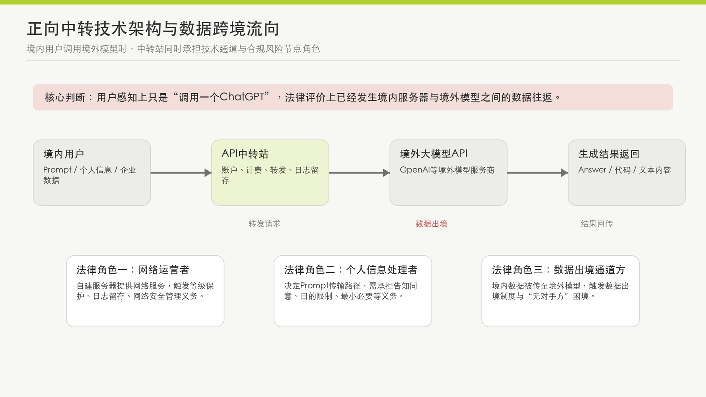
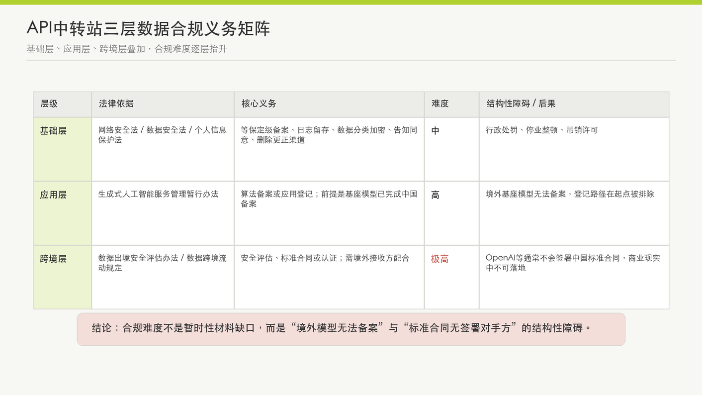
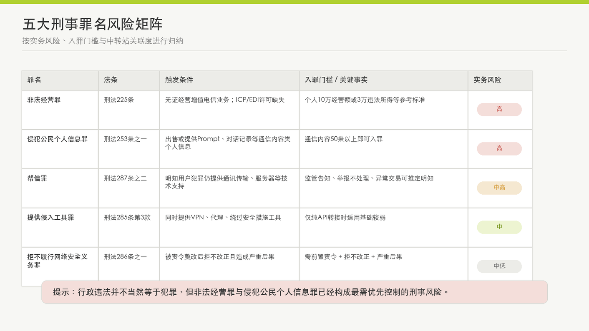
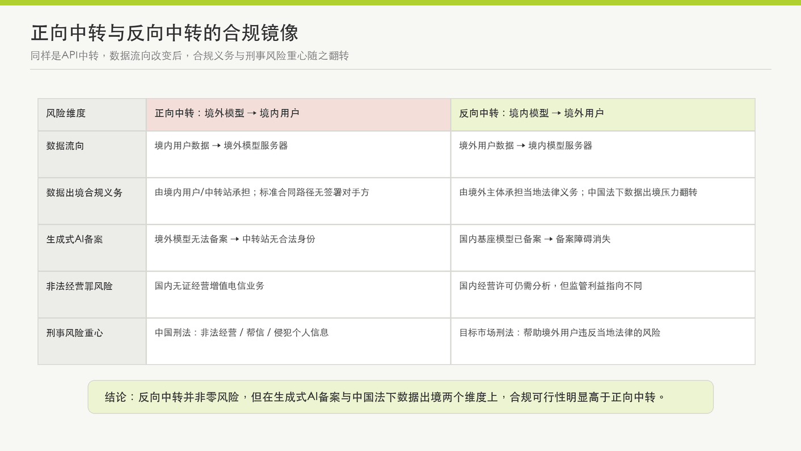
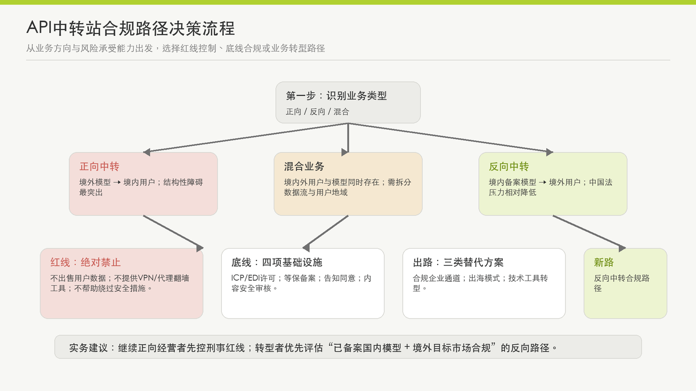

# 大模型API中转站的数据合规义务与刑事风险

——从业者合规防线构建指南

## 一、引言：API中转站的兴起与监管风暴

2026年5月，上海某头部AI中转站站长被警方刑事拘留，37天后取保候审，案件目前仍在侦查阶段。涉嫌罪名为非法经营罪。[1] 消息传出后，行业震动——大量民间API中转站集体关闭支付渠道、停止境内服务，被媒体称为“AI中转站的至暗时刻”。[2]

所谓“API中转站”（也称AI中转站、API Resell/Relay），是指运营者通过自建服务器，向境内用户提供境外大语言模型（如OpenAI GPT系列、Anthropic Claude等）的应用程序接口（API）转接服务，从中赚取境内外模型token差价的商业模式。用户无需直接访问境外模型官网，只需在中转站平台充值积分，即可调用各类大模型能力。2023年以来，随着ChatGPT等产品的全球热度，国内涌现了数百家类似平台，覆盖从个人开发者到中小企业的大量用户群体。

这一商业模式长期处于监管灰色地带。转折点出现在2026年：4月，中央网信办部署“清朗·整治AI应用乱象”专项行动，明确将“未按规定履行大模型备案登记义务”纳入整治范围；[3] 6月，国家安全部专门就AI中转站发布风险提示，点名数据跨境泄露、模型造假和非法经营三大问题。[4] 两记重锤之下，行业的“野蛮生长”阶段宣告结束。

本文的研究问题是：大模型API中转站在中国法下面临哪些数据合规义务与刑事风险？从业者应如何构建合规防线？本文定位为面向法律同行及潜在客户的实务分析，遵循“不求深入、但求准确”的写作原则——只写有法律依据和裁判案例支撑的判断，对存在争议的问题如实标注分歧，避免绝对化表述。文章首先界定API中转站的业务模式与法律角色（第二章），随后分别展开数据合规义务矩阵（第三章）和刑事风险图谱（第四章），再以“反向中转”——国内大模型面向海外用户的中转服务——作为镜像对比（第五章），最后提供分级合规行动指南（第六章）并给出结论与展望（第七章）。

## 二、业务模式与法律角色定位

### 2.1 正向中转：境外模型 → 境内用户

API中转站的核心业务——本文称为“正向中转”——技术架构可概括为三个节点：境内用户通过客户端发送API请求（Prompt）至中转服务器，中转服务器将该请求转发至境外大模型服务商的API端点，境外模型返回生成结果经中转服务器回传至境内用户。整个过程对用户透明——用户感知上只是在与一个“ChatGPT”对话，实际数据已经在境内服务器和境外模型之间完成了一次往返。

部分中转站使用代理IP地址或虚拟身份信息注册境外模型服务商账户，以绕过境外模型对来自中国IP的访问限制。这一技术手段在法律评价上具有独立意义，后文第四章将单独讨论。

### 2.2 反向中转：境内模型 → 境外用户

与正向中转形成镜像的是“反向中转”——运营者帮助境外用户调用境内已备案大模型（如DeepSeek、通义千问、文心一言等）的API能力。国内大模型token定价普遍低于GPT系列，海外存在真实市场需求，这一方向也具有商业合理性。反向中转的合规逻辑与正向中转存在根本性差异，第五章将专门对比。

### 2.3 法律角色拆解：三重身份叠加

API中转站在中国法律框架下不是单一角色。根据其业务特征，至少同时承载以下三层法律身份：

第一，网络运营者。根据《中华人民共和国网络安全法（2025修正）》第23条，“网络运营者”须履行网络安全等级保护义务，包括制定内部安全管理制度、采取防范网络攻击的技术措施、留存网络日志不少于六个月、实施数据分类和加密等。[5] API中转站通过自建服务器提供网络服务，在网络运营者定性上基本不存在争议。

第二，个人信息处理者。《中华人民共和国个人信息保护法》对“个人信息处理者”与“个人信息受托处理者”作了区分。中转站接收用户输入的Prompt文本——对话内容可能包含姓名、联系方式、医疗信息、代码、商业计划等——并决定其传输路径（发送至哪个境外模型），具有独立的处理目的和方式决定权，应定性为“个人信息处理者”而非单纯的“受托处理者”。相应的，中转站须承担告知-同意、目的限制、最小必要等个人信息保护义务。

第三，数据出境传输通道方。中转站将境内用户数据传输至境外模型服务器，构成《数据出境安全评估办法》第2条意义上的“数据出境”。[6] 中转站是数据跨境流动的关键节点——无论其自身是否被视为“数据处理者”（data controller），数据传输行为本身已然触发数据出境制度的适用。

第四（争议），生成式人工智能服务提供者。《生成式人工智能服务管理暂行办法》第2条将适用范围界定为“利用生成式人工智能技术向中华人民共和国境内公众提供生成文本、图片、音频、视频等内容的服务”。[7] API中转站是否属于“提供”服务？一种观点认为中转站仅提供技术通道，不构成“提供者”；另一种观点认为中转站构成面向公众的AI服务入口，应当纳入监管。从监管趋势看——网信办2026年“清朗”专项行动已明确将“未按规定履行大模型备案登记义务”纳入整治——后一种解释正在成为主流。本文对该角色的分析采“争议标注”方式：下文讨论生成式AI监管义务时，均注明该义务的适用以“中转站被认定为提供者”为前提。

## 三、数据合规义务矩阵

API中转站的数据合规义务可概括为三层递进结构：基础层（网络安全法/数据安全法/个人信息保护法的通用义务）、应用层（生成式AI服务的专项义务）和跨境层（数据出境的特别义务）。三层之间存在叠加效应，不合规的后果逐层加重。

### 3.1 基础层：网安法/数安法/个保法的通用义务

基础层的合规要求在API中转站场景下争议较小——中转站属于“网络运营者”和“个人信息处理者”，须履行以下核心义务：

网络安全等级保护。《网络安全法》第23条要求网络运营者按照网络安全等级保护制度，制定内部安全管理制度和操作规程、确定网络安全负责人、采取防范网络攻击和侵入的技术措施、留存网络日志不少于六个月、实施数据分类和加密。[5] 实践中，绝大多数民间API中转站未完成等级保护定级备案——这一项本身就构成行政违法，主管部门可以责令改正、给予警告并处罚款。

数据安全管理制度。《数据安全法》第27条要求数据处理者“建立健全全流程数据安全管理制度，组织开展数据安全教育培训，采取相应的技术措施和其他必要措施，保障数据安全”。[8] 对中转站而言，至少需要回答以下问题：用户数据存储在哪里？谁有权限访问？数据保留多久？是否有删除机制？第45条规定，不履行上述义务的，可处五万元以上五十万元以下罚款；拒不改正或造成大量数据泄露等严重后果的，处五十万元以上二百万元以下罚款，并可责令暂停业务、停业整顿、吊销许可证或营业执照；构成犯罪的，依法追究刑事责任。[9]

个人信息保护。《个人信息保护法》第52条要求处理个人信息达到规定数量的处理者指定个人信息保护负责人，公开其联系方式并报送主管部门。[10] 中转站收集的用户Prompt属于通信内容类信息，其中大量包含可识别自然人身份的内容。中转站须在收集前取得用户同意、告知处理目的和方式、提供查阅/更正/删除渠道。

### 3.2 应用层：生成式AI服务的专项义务

《生成式人工智能服务管理暂行办法》（2023年8月15日施行）创设了生成式AI服务的备案/登记制度。该办法第17条规定，提供具有舆论属性或社会动员能力的生成式AI服务的，应履行算法备案手续。[11] 对于通过API接口直接调用已备案模型能力的应用或功能，则由地方网信办进行登记而非备案。[12]

备案与登记的区分在公开讨论中常被提及，但其在API中转站场景下的实质意义有限。原因在于：登记的前提是基座模型已在中国完成备案。网信办的实践逻辑是——基座模型先备案，调用该模型的应用再登记。境外大模型（如GPT、Claude）不可能在中国网信办完成模型备案，因此，任何基于境外大模型的API中转服务，即便是“仅调用API”的登记路径，也在起点上被排除。

这不是法律的灰色地带，而是制度性空白——《暂行办法》的监管框架预设的监管对象是境内开发的生成式AI模型及其应用生态，境外模型向境内用户提供服务的情形未在其制度设计中得到充分考虑。对于从业者而言，这意味着：在生成式AI监管框架下，基于境外大模型的API中转站目前不存在获得合法身份的路径。

### 3.3 跨境层：数据出境的结构性障碍

这是三层义务中合规难度最高的一层。

API中转站将境内用户数据（Prompt文本）传输至境外大模型服务商进行处理，在《数据出境安全评估办法》第2条下构成“数据出境”。[13] 《促进和规范数据跨境流动规定》（2024年3月22日施行）更新了出境合规路径的触发门槛：向境外提供100万人以上个人信息或1万人以上敏感个人信息的，须申报数据出境安全评估；提供10万人以上、不满100万人个人信息（不含敏感个人信息）的，须与境外接收方订立个人信息出境标准合同或通过认证。[14]

法律文本上，路径是清晰的。但API中转场景面临两个层面的实践障碍。

第一个层面：数据出境合规义务的真正压力在于企业用户（数据控制者），而非中转站本身。中转站是企业用户数据出境的传输通道，但触发安全评估或标准合同义务的节点在用户方——用户是“数据处理者”，须自行评估其数据出境规模和性质。而绝大多数中转站的个人用户和小企业用户，对数据出境合规义务毫不知情。中转站若在用户协议中未作任何提示，可能面临“未尽告知义务”的过失责任。

第二个层面——也是更根本的困境：即使中转站愿意协助用户完成标准合同路径，标准合同的签署需要境外数据接收方作为签约对手方。在API中转场景中，该接收方是境外大模型服务商——OpenAI、Anthropic、Google等。这些公司不会与中国企业签署中国网信办制式的《个人信息出境标准合同》。这无关法律判断，是商业现实。

无论走安全评估路径（CBDT）——需要境外接收方配合提交大量材料和接受审查——还是标准合同路径（SECS）——需要境外接收方签署中国法律文件——都面临同一个结构性问题：没有签署对手方。亚马逊AWS等云服务商虽提供了数据出境合规工具，同样无法解决这一问题。就API中转场景而言，数据出境合规在法律上路径清晰，在商业现实中不可落地。

综合三层义务的分析，可以得出一个初步判断：API中转站在中国数据法框架下的合规难度是结构性的，而非暂时的。其中数据出境层的“无对手方困境”和生成式AI监管层的“境外模型无法备案”，是两个最具决定性的制度障碍。

## 四、刑事风险图谱与典型案例

行政违法不等于刑事犯罪，但两者之间存在可跨越的门槛。本章逐一分析API中转站面临的五个刑事罪名，按实务风险从高到低排列。

### 4.1 非法经营罪——《刑法》第225条

法律依据与适用逻辑

《刑法》第225条规定，违反国家规定，有“其他严重扰乱市场秩序的非法经营行为”，情节严重的，处五年以下有期徒刑或者拘役，并处或者单处违法所得一倍以上五倍以下罚金。[15] API中转站适用该罪的逻辑链条为：提供信息中转和数据处理服务→属于增值电信业务→根据《中华人民共和国电信条例》第9条、第14条须取得ICP/EDI经营许可证→绝大多数中转站未取得任何许可→构成“无证经营”→落入第225条第(四)项兜底条款。

各地高院对非法经营罪“情节严重”的追诉标准提供了参考：四川省高级人民法院意见规定，个人非法经营数额在10万元以上或违法所得3万元以上，单位经营数额在50万元以上或违法所得10万元以上，可视为“情节严重”；[16] 天津市高级人民法院等亦有类似规定。[17] 这一门槛对于运营数月以上的中大型中转站而言极易触达。

争议与案例

律师界对该罪在API中转场景的适用存在分歧。肖飒律师（北京大成律师事务所）认为，现有行政法规未直接规定无证经营电信业务须承担刑事责任，不能一刀切认定为非法经营罪。[18] 邵诗巍律师则指出，中转站通过代理IP、虚构身份信息帮助用户绕开海外模型访问限制，也可被认定为扰乱市场秩序，落入非法经营罪评价范围。[2]

然而，理论争议不能替代实务判断。2026年5月上海某AI中转站站长被刑事拘留37天——涉嫌罪名正是非法经营罪。[1] 这是公开报道中首例API中转站运营者被刑事追诉的案例。案件目前处于侦查阶段，最终是否起诉、判决结果如何尚不确定，但该案例至少证明：在当前的执法环境中，以非法经营罪追诉API中转站运营者是真实存在的风险，不是理论推演。

### 4.2 侵犯公民个人信息罪——《刑法》第253条之一

入罪门槛极低，是中转站场景下最容易被忽视的高风险罪名。

《刑法》第253条之一规定，违反国家有关规定，向他人出售或者提供公民个人信息，情节严重的，处三年以下有期徒刑或者拘役。[19] 根据《最高人民法院、最高人民检察院关于办理侵犯公民个人信息刑事案件适用法律若干问题的解释》，非法获取、出售或者提供“通信内容”类公民个人信息50条以上，即达到“情节严重”的追诉标准。[20]

API中转站的风险在于：部分中转站将用户输入的Prompt和对话记录打包出售给第三方模型厂商用于训练或数据分析——这是其低价策略的盈利基础。用户对话内容往往包含姓名、联系方式、病情描述、公司项目代码等个人信息。而中转站的日均数据处理量通常远超50条。

第253条之一第2款规定：“将在履行职责或者提供服务过程中获得的公民个人信息，出售或者提供给他人的，依照前款的规定从重处罚。”中转站属于“在提供服务过程中获得”个人信息，一旦出售，不仅入罪，且面临从重处罚。

### 4.3 帮助信息网络犯罪活动罪（帮信罪）——《刑法》第287条之二

帮信罪的风险取决于两个变量：用户是否利用中转站从事犯罪活动，以及运营者是否被认定为“明知”。

《刑法》第287条之二规定，明知他人利用信息网络实施犯罪，为其犯罪提供互联网接入、服务器托管、网络存储、通讯传输等技术支持，情节严重的，处三年以下有期徒刑或者拘役。[21] API中转站提供的API请求转发服务，在性质上属于“通讯传输”——这在帮信罪的裁判实践中已有大量先例，如GOIP设备（多卡宝）架设者被认定为帮信罪的案例。[22]

“明知”的认定是分水岭。根据司法解释，“明知”不限于确切知道——以下情形可以推定：（1）经监管部门告知后仍然实施有关行为的；（2）接到举报后不履行法定管理职责的；（3）交易价格或者方式明显异常的；（4）频繁采用隐蔽上网、加密通信、销毁数据等方式逃避监管的。[23] 换言之，如果中转站收到网信办或公安机关的通知后继续经营，或用户在其平台上明显从事违法活动（如生成诈骗话术）而中转站未采取阻断措施，帮信罪的“明知”要件即可满足。

此外，第287条之二第3款规定，帮信行为同时构成其他犯罪的，依照处罚较重的规定定罪处罚——这意味着帮信罪可能与非法经营罪产生罪名叠加效应，量刑时择一重处。

### 4.4 提供侵入、非法控制计算机信息系统程序、工具罪——《刑法》第285条第3款

该罪的风险相对集中：仅当API中转站同时提供VPN/代理类翻墙工具时才触发。

《刑法》第285条第3款规定，提供专门用于侵入、非法控制计算机信息系统的程序、工具，或者明知他人实施侵入、非法控制计算机信息系统的违法犯罪行为而为其提供程序、工具，情节严重的，处三年以下有期徒刑或者拘役。[24] 部分API中转站除提供API转接外，还向用户提供代理IP、VPN等工具以绕过境外大模型对境内访问的地域限制。如果该代理工具被认定为“专门用于侵入……计算机信息系统的程序、工具”，则运营者可独立构成本罪。

如果中转站的业务仅限于纯API转接（用户自行解决网络访问问题），则本罪的适用缺乏事实基础。

### 4.5 拒不履行信息网络安全管理义务罪——《刑法》第286条之一

该罪在API中转站场景下的实务触发概率较低，但不可完全忽视。其成立须满足多个前置条件：网络服务提供者不履行信息网络安全管理义务 → 经监管部门责令采取改正措施 → 拒不改正 → 且造成“致使违法信息大量传播”“致使用户信息泄露造成严重后果”“致使刑事案件证据灭失情节严重”等后果之一。[25] 前置条件多、因果关系链条长，实务中单独以该罪追诉中转站运营者的概率不高。但若发生重大数据泄露事件，且运营者此前已被监管部门告知整改而未整改，该罪可作为补充追诉路径。

### 4.6 关于“技术中立”抗辩

API中转站运营者可能主张“技术中立”——“我只是提供技术通道，用户怎么用我管不了。”在当前的司法实践中，这一抗辩在三个层面均难以成立：

• 非法经营罪层面：评价对象是经营行为本身（无证经营增值电信业务），而非用户后续使用行为。技术中立不能对抗经营许可制度。

• 帮信罪层面：“明知”的认定已被司法解释扩大。监管告知、举报不处理、异常交易价格均可推定明知，技术操作上的“中立”不能融化法律上的“应知”。

• 提供侵入工具罪层面：直接评价工具/程序本身的性质——如果工具是“专门用于”侵入计算机信息系统的，技术中立抗辩无效。

## 五、反向中转：国内模型出海的合规图景

与正向中转相比，反向中转——帮助境外用户使用国内已备案大模型API——的合规图景发生了根本性翻转。两者之间构成近乎完美的“合规镜像”。

### 5.1 镜像对比

### 5.2 海外法域合规要点

反向中转不意味着零风险。运营者须关注目标市场的法律环境：

欧盟：《通用数据保护条例》（Regulation (EU) 2016/679, GDPR）对个人数据跨境传输设有严格规则。[29] 境外用户数据传入中国境内模型服务器属于数据跨境传输，GDPR第44-49条对数据向第三国的传输施加了充分性认定、标准合同条款（SCCs）或约束性公司规则等保障措施要求。原则上，数据跨境传输的合规义务主要由境外的数据控制者（欧盟用户或其委托方）承担，中转站作为数据处理通道在中国法下的压力显著低于正向中转场景。但若中转站在欧盟设有机构或主动面向欧盟市场推广服务，GDPR第3条的地域适用范围可能直接触发合规义务。

美国：联邦层面尚无统一隐私法。加利福尼亚州《消费者隐私法》（CCPA，经CPRA修正）是美国目前最具影响力的州隐私立法。[30] 其他州（如弗吉尼亚、科罗拉多、康涅狄格等）也已颁布各自的综合隐私法。运营者须关注目标用户所在州的具体要求。此外，联邦层面的出口管制法规（EAR/ITAR）若适用于特定AI模型技术，可能对中转服务施加额外限制。

一般原则：建议运营者委托目标市场当地律师进行具体评估，至少覆盖数据保护、消费者保护和出口管制三个维度。

### 5.3 反向中转的市场逻辑

国内大模型的token定价普遍低于GPT系列——以DeepSeek-V3为例，其API输入价格约为每百万token 2元人民币，而GPT-4o为每百万token 2.5美元（约18元人民币），差距近9倍。[28] 海外开发者和中小企业在成本敏感型场景下存在真实需求。行业普遍认为这是“反向出海”的窗口期。从中国法合规的角度而言，反向中转的核心风险在生成式AI备案和数据出境两个维度上均大幅低于正向中转，是当前监管环境下相对合规可行的业务方向。

## 六、合规防线：分级行动指南

合规不是“全有或全无”的二元选择。不同规模、不同风险偏好的从业者，可以采取不同深度的合规策略。本章按风险紧迫程度分为四个层级。

### 6.1 🔴 红线：三个绝对禁止

以下三条适用于所有从业者，无论经营规模大小，逾越即面临实质刑事风险：

禁止一：出售或未经授权提供用户对话数据。用户Prompt和对话记录属于通信内容类个人信息，出售50条以上即达侵犯公民个人信息罪的追诉门槛。用户协议中默示的“我们可以将您的数据用于改善服务”不能替代明示同意——《个人信息保护法》第13条要求在收集环节取得“充分知情、自愿、明确”的同意，第14条进一步要求同意须由个人在充分知情的前提下自愿、明确作出。[26]

禁止二：提供VPN/代理类翻墙工具。即使作为API中转的“增值服务”提供，也可能触发《刑法》第285条第3款的提供侵入、非法控制计算机信息系统程序、工具罪。纯API转接业务（用户自行解决网络访问）不在此列。

禁止三：帮助用户绕过境外大模型的安全措施。包括但不限于：批量注册虚假账号、破解API速率限制、绕过内容安全过滤器等。此类行为在技术层面可能同时触发非法经营罪和提供侵入工具罪。

### 6.2 🟡 底线：四项合规基础设施

如果决定继续经营（尤其是正向中转），以下四项是行政合规的底线要求：

### （一）申请增值电信业务经营许可证。根据《电信条例》第9条，经营增值电信业务须取得ICP许可证；涉及在线数据处理与交易处理的，还须取得EDI许可证。[27] 申请条件包括：经营者为依法设立的公司、有与经营活动相适应的资金和专业人员、有为用户提供长期服务的信誉或能力等。须向省级通信管理局提交申请，审批时限为60日。

### （二）完成网络安全等级保护定级备案。这是《网络安全法》第23条的硬性要求，也是数据出境安全评估的前置条件之一。[5] 申请流程包括：自主定级→专家评审→主管部门备案→定期测评。

### （三）建立用户告知-同意机制。须在用户注册和使用环节明确告知：（a）数据将传输至境外服务器；（b）境外接收方的名称和联系方式；（c）数据处理的目的和方式；（d）用户享有的查阅/更正/删除权利。不得以“使用即视为同意”的默示方式替代明示同意。

### （四）建立内容安全审核机制。至少应包括：输入/输出内容关键词过滤、违法内容实时阻断、用户举报受理和处理流程、与执法机关的配合机制。这不只是为了降低帮信罪风险——也正在成为生成式AI监管的基本要求。

需要诚实提示：完成上述四项，仍然不能解决第三章分析的两个结构性障碍——数据出境标准合同的“无对手方困境”和境外大模型的“结构性排除”。从业者须对此有清醒认知。

### 6.3 🟢 出路：三个替代方案

对于不愿在灰色地带继续经营的从业者，以下三个方向可以实现业务转型：

方案一：合规企业通道。与已备案的境内大模型服务商（如阿里云百炼、华为云盘古、字节豆包等）合作，通过其合法API渠道向用户提供模型能力。优势在于：模型已备案、数据不出境（或通过云服务商的合规基础设施处理）、ICP许可由云服务商持有或可协助申请。代价是模型能力选择范围受限、灵活性降低。

方案二：出海模式。将运营主体设在境外（如新加坡、香港），仅面向境外用户提供API中转服务。此模式下中国《网络安全法》《数据安全法》《个人信息保护法》及《生成式AI暂行办法》的域外适用有限，主要的合规压力转移至运营主体所在地和用户所在地的法律。

方案三：技术工具转型。从“中转服务商”转型为“技术工具提供商”——提供本地部署的API管理网关、负载均衡器、多模型统一调用框架等软件产品。软件的本地部署不涉及数据中转和出境，ICP许可要求也不同。这一模式将业务性质从“电信服务”转变为“软件销售/许可”，法律风险显著降低。

### 6.4 🔵 新路：反向中转的具体合规路径

反向中转的合规优势在第五章已经分析。对于希望沿此方向发展的从业者，具体步骤如下：

1. 选择已备案的国内基座大模型——截至2025年11月，累计611款生成式AI服务已完成备案，选择空间充足。[12]

2. 确认技术架构不涉及境内用户数据——如果完全面向境外用户，中国法下的数据出境义务翻转。

3. 委托目标市场律师评估当地合规要求——至少覆盖数据保护（GDPR/CCPA等）、消费者保护、出口管制三个维度。

4. 运营主体层面：可考虑在目标市场或中立司法管辖区设立法律实体，隔离中国运营主体的法律责任。

## 七、结论与展望

大模型API中转站在中国现行法律框架下面临的困境可以用一句话概括：法无明文禁止，不等于可以合规经营。三个层次的数据合规义务中，数据出境层的“无对手方困境”和生成式AI监管层的“境外模型结构性排除”，使得从业者即便有合规意愿也缺乏合规基础设施。刑事风险方面，非法经营罪已从理论推演进入实务追诉阶段——上海首例刑拘案例是明确的信号。

但这不意味着所有从业者面前只有“关停”一条路。反向中转——帮助国内已备案大模型服务海外用户——是当前监管环境下相对合规可行的方向。继续经营正向中转的从业者，至少应完成增值电信许可、网络安全等级保护、用户告知同意和内容审核四项底线合规，并严守三条红线——不出售数据、不提供翻墙工具、不帮助绕过安全措施。转型者则可以沿着合规企业通道、出海模式和技术工具转型三条路径重新定位。

展望未来，两个趋势值得关注。其一，《人工智能法》已被列入全国人大常委会立法规划，该法有望为生成式AI服务——包括API层级服务的监管——提供更完整的法律框架。其二，数据出境制度的“无对手方困境”可能通过双边或多边数据跨境合作机制（如中国加入或对标CBPR体系）得到缓解，但短期内难有突破。

最后回到本文开篇提及的上海案例。该案的最终处理结果——是否起诉、以何种罪名、如何量刑——将在很大程度上影响这一行业的走向。但无论个案结果如何，一个基本判断不会改变：在这个领域，法律风险是真实存在的，恐惧不能替代分析，但侥幸更不是合规策略。

参考文献

[1] 金诚同达律师事务所，《AI犯罪案例分析：AI中转站站长被上海警方抓捕，灰色赛道的合规警示》，2026年6月，https://kindinglaw.com/news/shownews.php?id=164

[2] 邵诗巍律师，《刑拘37天，第一批靠“AI中转站”发财的人开始进去了》，2026年5月，https://www.panewslab.com/zh/articles/019e48cd-d95c-7454-a68e-b25331b42b8a

[3] 中央网信办，《“清朗·整治AI应用乱象”专项行动》，2026年4月30日，https://www.cac.gov.cn/2026-04/30/c_1779289298718765.htm

[4] 通信世界网，《“AI中转站”暗藏风险，国安部发布风险提示》，2026年6月，http://www.cww.net.cn/article?id=019A903955EA4BC7AD240EC24366BB25

[5] 《中华人民共和国网络安全法（2025修正）》第23条

[6] 《数据出境安全评估办法》（国家互联网信息办公室令第11号，2022年9月1日施行）第2条

[7] 《生成式人工智能服务管理暂行办法》（2023年8月15日施行）第2条

[8] 《中华人民共和国数据安全法》第27条

[9] 《中华人民共和国数据安全法》第45条

[10] 《中华人民共和国个人信息保护法》第52条

[11] 《生成式人工智能服务管理暂行办法》第17条

[12] 国家互联网信息办公室，《关于发布生成式人工智能服务已备案信息的公告（2025年9月至10月）》，2025年11月11日，https://www.cac.gov.cn/2025-11/11/c_1764585284364412.htm

[13] 《数据出境安全评估办法》第2条、第4条

[14] 《促进和规范数据跨境流动规定》（国家互联网信息办公室令第16号，2024年3月22日施行）第7条、第8条

[15] 《中华人民共和国刑法（2023修正）》第225条

[16] 四川省高级人民法院《关于刑法部分条款数额执行标准和情节认定标准的意见》（节录）第31条

[17] 天津市高级人民法院、天津市人民检察院、天津市公安局等《关于刑法部分罪名数额执行标准和情节认定标准的意见》相关条款

[18] 肖飒律师团队（北京大成律师事务所），《在国内未获许可开AI中转站，“真刑”吗？》，2026年6月，https://www.sfccn.com/2026/5-28/4OMDE0NDlfMjE1MTU4OQ.html

[19] 《中华人民共和国刑法（2023修正）》第253条之一

[20] 《最高人民法院、最高人民检察院关于办理侵犯公民个人信息刑事案件适用法律若干问题的解释》第5条

[21] 《中华人民共和国刑法（2023修正）》第287条之二

[22] 最高人民法院、最高人民检察院、公安部联合发布依法惩治帮助信息网络犯罪活动及相关犯罪典型案例之一：张某某帮助信息网络犯罪活动案；典型案例之二：邓某某、王某某帮助信息网络犯罪活动案（GOIP设备通讯传输支持）

[23] 《最高人民法院、最高人民检察院关于办理非法利用信息网络、帮助信息网络犯罪活动等刑事案件适用法律若干问题的解释》第11条

[24] 《中华人民共和国刑法（2023修正）》第285条第3款

[25] 《中华人民共和国刑法（2023修正）》第286条之一

[26] 《中华人民共和国个人信息保护法》第13条、第14条

[27] 《中华人民共和国电信条例（2016修订）》第9条、第14条

[28] DeepSeek API定价页面，https://platform.deepseek.com/api-docs/pricing ；OpenAI API定价页面，https://openai.com/api/pricing/ （各模型定价以官方页面实时更新为准，本文仅提供截至2026年6月的参考量级）

[29] Regulation (EU) 2016/679 of the European Parliament and of the Council (General Data Protection Regulation), Articles 3, 44-49, https://eur-lex.europa.eu/eli/reg/2016/679/oj

[30] California Consumer Privacy Act of 2018 (CCPA), Cal. Civ. Code §§ 1798.100-1798.199.100, as amended by the California Privacy Rights Act of 2020 (CPRA)

免责声明：本文基于截至2026年6月的公开法律法规、裁判文书及媒体报道撰写，仅供法律研究和业务参考，不构成正式法律意见。具体案件的法律适用须由持证律师结合个案事实进行分析。法律法规及监管政策可能随时更新。
