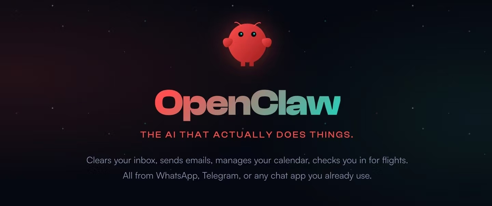

# OpenClaw代装服务的法律风险研判——基于帮信罪构成要件的实务分析

引言：

近些天来，“养龙虾”一词火爆出圈，所谓的龙虾，也就是OpenClaw（曾用名Clawdbot、Moltbot）是一款开源AI智能体。其凭借“AI操控电脑”的核心功能优势迅速兴起，受到科技爱好者及职场群体的广泛关注与追捧。它的吉祥物是一只龙虾，中文社区称使用OpenClaw为“养龙虾”。这只“龙虾”通过整合多渠道通信能力与大语言模型，构建出一个具备持久记忆、主动执行能力的定制化AI助手，并且可以在本地私有化部署。就像是电影《钢铁侠》中的贾维斯，这只“龙虾”不到5个月成为GitHub全球第一，绝对可谓是一个现象级的应用。

OpenClaw的火爆背后蕴藏着大量法律风险：根据GitHub仓库相关数据显示，ClawHub 13,729个Skills中超过50%被判定为垃圾/重复/低质量，396个被标记为恶意。一觉醒来收到$1,100API账单的恐怖故事在社区频繁出现。CVE-2026-25253RCE漏洞曾让13.5万个暴露实例面临风险。可见，“养龙虾”虽然火，但其中的风险不可小觑。

工信部已有风险预警

2026年2月5日，工业和信息化部网络安全威胁和漏洞信息共享平台（NVDB）监测发现OpenClaw开源AI智能体部分实例在默认或不当配置情况下存在较高安全风险，极易引发网络攻击、信息泄露等安全问题。

由于OpenClaw在部署时“信任边界模糊”，且具备自身持续运行、自主决策、调用系统和外部资源等特性，在缺乏有效权限控制、审计机制和安全加固的情况下，可能因指令诱导、配置缺陷或被恶意接管，执行越权操作，造成信息泄露、系统受控等一系列安全风险。

建议相关单位和用户在部署和应用OpenClaw时，充分核查公网暴露情况、权限配置及凭证管理情况，关闭不必要的公网访问，完善身份认证、访问控制、数据加密和安全审计等安全机制，并持续关注官方安全公告和加固建议，防范潜在网络安全风险。

## 一、OpenClaw代装服务的行业乱象及其风险隐患

由于OpenClaw的部署需具备专业的代码拉取、环境配置能力，技术门槛较高，市面上逐步衍生出各类有偿代安装服务，定价区间覆盖几十元至数千元不等。此类服务看似能够为用户规避部署过程中的技术难题，实则潜藏着显著的刑事法律风险，这些提供代客上门安装的从业者，均可能在无意识的情况下触犯帮助信息网络犯罪活动罪（以下简称“帮信罪”）及其他一系列相关罪名。

笔者结合我国现行刑事法律规定、最新司法解释及行业实践乱象，系统拆解OpenClaw代装服务背后的帮信罪构成要件与风险节点，既为相关主体提供风险识别指引，也进一步明确AI行业创新发展与法律风险之间的边界。

结合行业实践来看，此类服务存在三大突出问题，不仅损害用户合法权益，更为帮信罪的成立埋下前置隐患：

- 操作不规范，存在明显安全漏洞：部分代装从业者为降低操作成本、提高服务效率，在部署过程中存在诸多违规操作，如将OpenClaw端口直接暴露于公网、将API Key以明文形式写入配置文件、采用超级权限启动程序且未采取任何安全防护措施。此类操作不仅易导致用户设备被非法入侵，更可能使设备沦为网络攻击的工具，间接为信息网络犯罪提供硬件与技术支撑。

- 代装服务质量与需求脱节，易沦为犯罪辅助工具：多数代装从业者仅掌握基础部署技能，缺乏对OpenClaw功能适配与风险防控的专业认知，在完成安装后未提供后续的风险指导与技术维护。部分不法分子利用此类未采取安全防护措施的设备，实施网络诈骗、非法获取公民个人信息等信息网络犯罪活动，代装从业者若对该类行为存在明知或放任态度，即可能构成帮信罪。

- 售后保障缺失，隐形法律风险叠加：部分服务提供者所承诺的“包教包会”“免费答疑”等售后保障多为虚假宣传，用户后续遇到技术问题需额外支付费用。更为严重的是，少数代装人员借“调试设备”之名，复制用户API Key、留存系统后门，进而窃取用户隐私信息、商业机密，甚至倒卖相关数据。此类行为本身已涉嫌违法犯罪。借配置漏洞批量窃取API密钥、Cookie、SSH密钥、账号凭证可能构成非法获取计算机信息系统数据罪。接管他人“裸奔”实例，用于挖矿、DDoS攻击、植入后门，非法控制计算机信息系统。可能构成非法控制计算机信息系统罪。开发、售卖带后门的OpenClaw改装版、恶意技能包，程序专门用于侵入、控制，可能构成提供侵入、非法控制计算机信息系统程序、工具罪。

## 二、帮信罪的构成要件解析及其在OpenClaw代装场景中的适用

根据《中华人民共和国刑法》第二百八十七条之二的规定，帮信罪的成立需同时满足主观明知、客观帮助行为、情节严重三个核心构成要件，三者缺一不可。结合2025年7月最高人民法院、最高人民检察院、公安部联合发布的《关于办理帮助信息网络犯罪活动等刑事案件有关问题的意见》（以下简称“2025年意见”）及2022年相关会议纪要等最新司法解释，结合OpenClaw代装服务的具体场景，笔者对三个构成要件逐一进行实务解读：

### （一）主观要件：“明知”的综合认定标准

实践中，部分代装从业者常以“仅提供软件安装服务，未知晓对方犯罪意图”为由进行抗辩，但刑法意义上的“明知”，并非特指明确知晓对方的具体犯罪行为，而是结合行为人的认知能力、行为方式、获利情况等综合因素认定的主观认知状态。

依据2025年意见及2022年会议纪要的相关规定，在OpenClaw代装服务中，具有下列情形之一的，就有可能被推定行为人具有帮信罪的“主观明知”（有相反证据足以推翻的除外）：

- 用户明确要求代装过程中不采取安全防护措施、暴露公网端口，或暗示该工具将用于批量操作、规避监管等可疑用途，代装从业者仍继续提供服务的；

- 代装从业者频繁为不特定陌生人提供OpenClaw代装服务，且对方支付的报酬显著高于市场合理价格，或要求通过现金、匿名转账等规避监管的方式结算报酬的；

- 代装从业者事先准备应对司法调查的话术，刻意规避监管或调查，隐瞒自身服务行为的；

需特别明确的是，2025年意见已明确规定，“明知”的认定需结合行为人的认知能力、职业身份、非法获利数额、行为方式等客观事实综合判断，不再单纯以行为人供述或“单纯提供技术服务”为由免除刑事责任。

### （二）客观要件：“帮助行为”的认定边界

《中华人民共和国刑法》明确列举了帮信罪的帮助行为，主要包括提供互联网接入、服务器托管、网络存储、通讯传输等技术支持。结合OpenClaw代装服务的实践特征，下列行为均可能被认定为帮信罪中的“技术支持”，构成客观层面的帮助行为：

- 在为他人部署OpenClaw的过程中，故意留存系统后门、暴露端口，为他人利用该工具实施信息网络犯罪提供技术便利的；

- 擅自复制用户API Key、留存系统控制权，间接帮助他人实施数据窃取、模型调用费用盗刷等违法犯罪行为的；

- 批量为他人提供OpenClaw代装服务，且明知或应知对方可能利用该工具从事信息网络犯罪活动，仍持续提供部署、调试等技术支持的。

需注意的是，帮信罪的“帮助行为”并非局限于刑法明确列举的情形，只要行为人为信息网络犯罪的实施提供了实质性技术支持，均可能被认定为帮信行为。这一认定标准，也是AI技术服务从业者面临的主要法律风险点。

### （三）情节要件：“情节严重”的法定认定标准

结合2019年《最高人民法院、最高人民检察院关于办理非法利用信息网络、帮助信息网络犯罪活动等刑事案件适用法律若干问题的解释》及2025年意见的最新规定，在OpenClaw代装服务场景中，具有下列情形之一的，可能被认定为帮信罪“情节严重”，依法触发刑事追责：

- 为3个以上不同对象提供OpenClaw代装服务，且被帮助对象利用该工具实施信息网络犯罪并达到追诉标准的；

- 通过OpenClaw代装服务非法获利1万元以上的；

- 3.两年内曾因非法利用信息网络、帮信罪受过行政处罚，又从事OpenClaw代装服务，被认定为帮助信息网络犯罪活动的。

## 三、OpenClaw代装服务中帮信罪的高发人群分析

结合AI行业发展特征及刑事司法实践经验，下列三类人群是OpenClaw代装服务中帮信罪的高发群体，需重点强化风险防控意识：

- 兼职代装从业者：此类群体多为学生、职场兼职人员，具备基础的技术操作能力，以获取少量劳务报酬为目的从事代装服务，往往忽视对客户用途的审核，一旦被帮助对象利用所部署的OpenClaw实施信息网络犯罪，该类群体即可能被认定为帮信罪共犯，承担刑事责任。

- AI技术爱好者：该类群体自身具备OpenClaw部署的专业能力，出于分享技术、获取收益的目的，批量为他人提供代装服务，但未建立完善的风险防控机制，未对客户用途进行审核，无意间成为信息网络犯罪的辅助者，触发帮信罪风险。

- 小型科技公司及工作室：部分小型科技公司、工作室以“AI技术服务”为名义，推出OpenClaw代装、调试等相关服务套餐，为追求经济利益批量接单，甚至主动为客户提供规避监管的操作建议，主观上放任信息网络犯罪风险，极易构成帮信罪，情节严重的，还可能构成单位犯罪。

## 四、OpenClaw相关主体的刑事合规建议

AI技术的创新发展与法律规定并非对立关系，而是相辅相成的有机整体。为防范OpenClaw代装服务中的帮信罪和其他刑事犯罪风险，本文结合相关法律规定与行业实践，针对不同主体提出以下三点法律建议：

- 代装从业者：在承接服务订单时，应严格审核客户的服务用途，坚决拒绝“无需安全防护”“批量部署”“匿名结算”等可疑需求；规范服务操作流程，不留存系统后门、不复制用户API Key，妥善留存服务记录；若发现客户可能利用OpenClaw实施信息网络犯罪，应立即终止服务，并及时向公安机关报案。

- AI行业从业者：在从事AI技术服务过程中，应系统学习帮信罪等相关刑事法律规定及司法解释，建立健全合规审查机制，杜绝提供可能被用于信息网络犯罪的技术支持；需明确，2025年意见已明确“利用人工智能技术实施犯罪的，依法从严惩处”，AI技术的应用与创新必须坚守法律底线。

- 涉嫌帮信罪相关人员：若已实施相关行为并涉嫌帮信罪，应立即终止违法行为，主动留存相关证据，及时委托专业刑事律师介入；若存在“被诱骗实施犯罪”“非法获利数额较少”“认罪认罚”等法定从宽情节，可依据2025年意见及相关刑事法律规定，争取从宽处罚，包括不起诉、免予刑事处罚等。

## 结语

OpenClaw的兴起，是AI技术快速发展的必然结果，但其衍生的代装服务所潜藏的帮信罪风险，需引起行业及社会各界的高度重视。帮信罪的认定并非局限于明确的犯罪故意，而是结合行为人的客观行为、主观认知、获利情况等综合判断，这也使得诸多看似“无害”的代装行为，可能触发刑事追责。

AI技术本身无善恶之分，但其应用必须纳入法律规制的范畴。未来，笔者将持续关注AI行业的法律动态，为AI行业从业者、相关服务提供者及普通用户提供风险防控指引，助力AI行业在合规框架内实现健康、有序发展。
